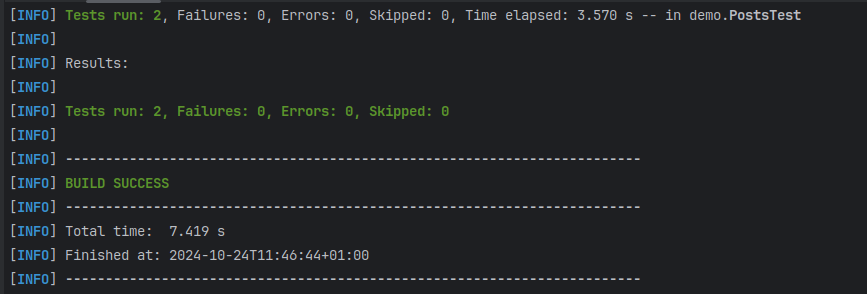

# Rest assured project

This project have a proposal to use the rest assured to test the API Rest.

I used the weather open API there you can create a register and access to an API key that allow you to execute a limited requests due to run your tests.

https://jsonplaceholder.typicode.com/

* Limitation
* * Only get requests allowed.

## Considerations

Do you need to have Java Sdk, Junit5, Maven and Docker installed.

## How to run the tests

### Create docker image
Do you need to create a docker image, at main root run the command:

` docker build -t myrestimage:1 . `

**docker build:** The command to create the docker image.

**-t:** The tag option to name the image, otherwise it will receive a random name.
**.** The root directory where the Dockerfile is.

### Create a docker container
Do you need to run the container, since the image was successfully created, you can create a container, that will run the tests 
inside and show the test status.

`docker run --name myresttest myrestimage:1`

**docker run:** The command to create a container.

**--name:** The option to name a container.

**myrestimage:1:** The docker image to create a container.

